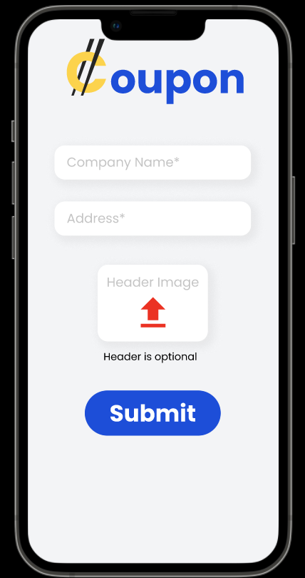

# Coupon

[](https://coupons.andrewli.site/)

## For students

Coupon is a mobile first app that allows students to find coupons for their favorite stores. It also allows stores to create and manage coupons.

Check it out now @ [coupons.andrewli.site](https://coupons.andrewli.site/)

## Snapshots





---

## Documentation

This is an app bootstrapped according to the [init.tips](https://init.tips) stack, also known as the T3-Stack.

## Why are there `.js` files in here?

As per [T3-Axiom #3](https://github.com/t3-oss/create-t3-app/tree/next#3-typesafety-isnt-optional), we take typesafety as a first class citizen. Unfortunately, not all frameworks and plugins support TypeScript which means some of the configuration files have to be `.js` files.

We try to emphasize that these files are javascript for a reason, by explicitly declaring its type (`cjs` or `mjs`) depending on what's supported by the library it is used by. Also, all the `js` files in this project are still typechecked using a `@ts-check` comment at the top.

## What's next? How do I make an app with this?

We try to keep this project as simple as possible, so you can start with the most basic configuration and then move on to more advanced configuration.

If you are not familiar with the different technologies used in this project, please refer to the respective docs. If you still are in the wind, please join our [Discord](https://t3.gg/discord) and ask for help.

- [Next-Auth.js](https://next-auth.js.org)
- [Prisma](https://prisma.io)
- [TailwindCSS](https://tailwindcss.com)
- [tRPC](https://trpc.io) (using @next version? [see v10 docs here](https://alpha.trpc.io))

Also checkout these awesome tutorials on `create-t3-app`.

- [Build a Blog With the T3 Stack - tRPC, TypeScript, Next.js, Prisma & Zod](https://www.youtube.com/watch?v=syEWlxVFUrY)
- [Build a Live Chat Application with the T3 Stack - TypeScript, Tailwind, tRPC](https://www.youtube.com/watch?v=dXRRY37MPuk)
- [Build a full stack app with create-t3-app](https://www.nexxel.dev/blog/ct3a-guestbook)
- [A first look at create-t3-app](https://dev.to/ajcwebdev/a-first-look-at-create-t3-app-1i8f)

## How do I deploy this?

### Vercel

We recommend deploying to [Vercel](https://vercel.com/?utm_source=t3-oss&utm_campaign=oss). It makes it super easy to deploy NextJs apps.

- Push your code to a GitHub repository.
- Go to [Vercel](https://vercel.com/?utm_source=t3-oss&utm_campaign=oss) and sign up with GitHub.
- Create a Project and import the repository you pushed your code to.
- Add your environment variables.
- Click **Deploy**
- Now whenever you push a change to your repository, Vercel will automatically redeploy your website!

### Docker

You can also dockerize this stack and deploy a container.

Please note that Next.js requires a different process for buildtime (available in the frontend, prefixed by `NEXT_PUBLIC`) and runtime environment, server-side only, variables. In this demo we are using two variables, `DATABASE_URL` (used by the server) and `NEXT_PUBLIC_CLIENTVAR` (used by the client). Pay attention to their positions in the `Dockerfile`, command-line arguments, and `docker-compose.yml`.

1. In your [next.config.mjs](./next.config.mjs), add the `standalone` output-option to your config:

   ```diff
     export default defineNextConfig({
       reactStrictMode: true,
       swcMinify: true,
   +   output: "standalone",
     });
   ```

2. Remove the `env`-import from [next.config.mjs](./next.config.mjs):

   ```diff
   - import { env } from "./src/env/server.mjs";
   ```

3. Create a `.dockerignore` file with the following contents:
   <details>
   <summary>.dockerignore</summary>

   ```
   .env
   Dockerfile
   .dockerignore
   node_modules
   npm-debug.log
   README.md
   .next
   .git
   ```

  </details>

4. Create a `Dockerfile` with the following contents:
   <details>
   <summary>Dockerfile</summary>

   ```Dockerfile
   ########################
   #         DEPS         #
   ########################

   # Install dependencies only when needed
   # TODO: re-evaluate if emulation is still necessary on arm64 after moving to node 18
   FROM --platform=linux/amd64 node:16-alpine AS deps
   # Check https://github.com/nodejs/docker-node/tree/b4117f9333da4138b03a546ec926ef50a31506c3#nodealpine to understand why libc6-compat might be needed.
   RUN apk add --no-cache libc6-compat openssl
   WORKDIR /app

   # Install Prisma Client - remove if not using Prisma
   COPY prisma ./

   # Install dependencies based on the preferred package manager
   COPY package.json yarn.lock* package-lock.json* pnpm-lock.yaml* ./
   RUN \
     if [ -f yarn.lock ]; then yarn --frozen-lockfile; \
     elif [ -f package-lock.json ]; then npm ci; \
     elif [ -f pnpm-lock.yaml ]; then yarn global add pnpm && pnpm i; \
     else echo "Lockfile not found." && exit 1; \
     fi

   ########################
   #        BUILDER       #
   ########################

   # Rebuild the source code only when needed
   # TODO: re-evaluate if emulation is still necessary on arm64 after moving to node 18
   FROM --platform=linux/amd64 node:16-alpine AS builder

   ARG DATABASE_URL
   ARG NEXT_PUBLIC_CLIENTVAR

   WORKDIR /app
   COPY --from=deps /app/node_modules ./node_modules
   COPY . .

   # Next.js collects completely anonymous telemetry data about general usage.
   # Learn more here: https://nextjs.org/telemetry
   # Uncomment the following line in case you want to disable telemetry during the build.
   # ENV NEXT_TELEMETRY_DISABLED 1

   RUN \
     if [ -f yarn.lock ]; then yarn build; \
     elif [ -f package-lock.json ]; then npm run build; \
     elif [ -f pnpm-lock.yaml ]; then yarn global add pnpm && pnpm run build; \
     else echo "Lockfile not found." && exit 1; \
     fi

   ########################
   #        RUNNER        #
   ########################

   # Production image, copy all the files and run next
   # TODO: re-evaluate if emulation is still necessary after moving to node 18
   FROM --platform=linux/amd64 node:16-alpine AS runner
   # WORKDIR /usr/app
   WORKDIR /app

   ENV NODE_ENV production
   # Uncomment the following line in case you want to disable telemetry during runtime.
   # ENV NEXT_TELEMETRY_DISABLED 1

   RUN addgroup --system --gid 1001 nodejs
   RUN adduser --system --uid 1001 nextjs

   COPY --from=builder /app/next.config.mjs ./
   COPY --from=builder /app/public ./public
   COPY --from=builder /app/package.json ./package.json

   # Automatically leverage output traces to reduce image size
   # https://nextjs.org/docs/advanced-features/output-file-tracing
   COPY --from=builder --chown=nextjs:nodejs /app/.next/standalone ./
   COPY --from=builder --chown=nextjs:nodejs /app/.next/static ./.next/static

   USER nextjs

   EXPOSE 3000

   ENV PORT 3000

   CMD ["node", "server.js"]
   ```

  </details>

5. To build and run this image locally, run:

   ```bash
   docker build -t ct3a -e NEXT_PUBLIC_CLIENTVAR=clientvar .
   docker run -p 3000:3000 -e DATABASE_URL="database_url_goes_here" ct3a
   ```

6. You can also use a PaaS such as [Railway's](https://railway.app) automated [Dockerfile deployments](https://docs.railway.app/deploy/dockerfiles) to deploy your app.

### Docker Compose

You can also use docker compose to build the image and run the container.

1. Follow steps 1-4 above

2. Create a `docker-compose.yml` file with the following:

   <details>
   <summary>docker-compose.yml</summary>

   ```yaml
   version: "3.9"
   services:
     app:
       platform: "linux/amd64"
       build:
         context: .
         dockerfile: Dockerfile
         args:
           NEXT_PUBLIC_CLIENTVAR: "clientvar"
       working_dir: /app
       ports:
         - "3000:3000"
       image: t3-app
       environment:
         - DATABASE_URL=database_url_goes_here
   ```

   </details>

3. Run this using `docker compose up`.

### Further reading

Here are some useful references you can further look into:

- [Dockerfile reference](https://docs.docker.com/engine/reference/builder/)
- [Compose file version 3 reference](https://docs.docker.com/compose/compose-file/compose-file-v3/)
- [Docker CLI reference](https://docs.docker.com/engine/reference/commandline/docker/)
- [Docker Compose CLI reference](https://docs.docker.com/compose/reference/)

## Useful resources

Here are some resources that we commonly refer to:

- [Protecting routes with Next-Auth.js](https://next-auth.js.org/configuration/nextjs#unstable_getserversession)
